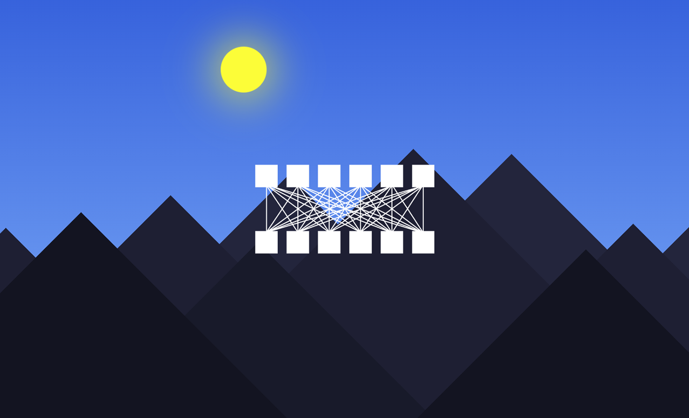

[![Contributors][contributors-shield]][contributors-url]
[![MIT License][license-shield]][license-url]
[![Forks][forks-shield]][forks-url]
[![Stargazers][stars-shield]][stars-url]
[![Issues][issues-shield]][issues-url]
[![LinkedIn][linkedin-shield]][linkedin-url]

 

  

  <h3 align="center">Grams</h3>

  

    Created by Shawn Rodgers</a>
     
     
  

[contributors-shield]: https://img.shields.io/github/contributors/directedbyshawn/Grams.svg?style=for-the-badge
[contributors-url]: https://github.com/directedbyshawn/Grams/graphs/contributors
[license-shield]: https://img.shields.io/github/license/othneildrew/Best-README-Template.svg?style=for-the-badge
[license-url]: https://github.com/directedbyshawn/Grams/LICENSE.txt
[forks-shield]: https://img.shields.io/github/forks/directedbyshawn/Grams.svg?style=for-the-badge
[forks-url]: https://github.com/directedbyshawn/Grams/network/members
[stars-shield]: https://img.shields.io/github/stars/directedbyshawn/Grams.svg?style=for-the-badge
[stars-url]: https://github.com/directedbyshawn/Grams/stargazers
[issues-shield]: https://img.shields.io/github/issues/directedbyshawn/Grams.svg?style=for-the-badge
[issues-url]: https://github.com/directedbyshawn/Grams/issues
[linkedin-shield]: https://img.shields.io/badge/-LinkedIn-black.svg?style=for-the-badge&logo=linkedin&colorB=555
[linkedin-url]: https://linkedin.com/in/directedbyshawn
