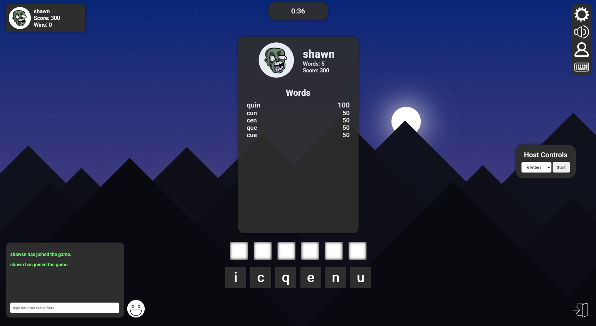

 

  

  <h4 align="center" style="margin-bottom:20px;"><a href="https://www.grams.live" target="_blank" disabled><strike>grams.live</strike> (down for the foreseeable future)</a></h4>

<h2>Table of Contents</h2>

- [Overview](#overview)
- [Demo](#demo)
- [License](#license)
- [Contact](#contact)
- [Credits](#credits)

<h2>Overview</h2>

 

    </img>

 

Two of my friends really like playing each other in anagrams via iMessage. When you play on iMessage, one person plays, and then sends the game to the other person. The two players dont play the game at the same time - the sender must wait for the recipient to see it and play them back. I feel like this creates a disconnect, because the recipient may not see the game for hours, or even days. I thought it would be more fun to play against each other in real time, and see each others scores and word lists immediately after the game completes. Game pidgeon also only lets two people play each other at a time. Pretty lame. I arbitrarily set the max player count in the config to be 6, but this can be increased.

This is not a serious project. It is not meant to be scalable. The site is technically public, but I dont plan on promoting it anywhere. There are no private lobbies, so only one group of people can play at a time. The sole purpose of this project was to make something that me and my friends could have fun with. Mission accomplished.

 

(<a href="#readme-top">back to top</a>)

## Demo

To try the game out for yourself: 

* Navigate to <a href="https://www.grams.live" target="_blank">grams.live</a>
* Type in a username and hit enter on your keyboard
* If you would like to play with a friend, have them do the same. You can play solo if you'd like.
* If you are the host of the lobby, hit play in the game settings panel whenever you're ready.
* When the countdown completes, start building words with the letters at the bottom of your screen
* Enjoy!

(<a href="#readme-top">back to top</a>)

## License

Distributed under the MIT License. See `LICENSE` for more information.

(<a href="#readme-top">back to top</a>)

## Contact

me@bentsignal.com

[bentsignal.com](https://www.bentsignal.com)

[linkedin.com/in/bentsignal](https://www.linkedin.com/in/bentsignal)

(<a href="#readme-top">back to top</a>)

## Credits
* Character design & illustration: Ben Holzman
    - <a href="https://benholzman3.wixsite.com/bennett-holzman" target="_blank">Website</a>
    - <a href="mailto://benholzman@comcast.net" target="_blank">Email</a>
    - <a href="https://www.instagram.com/nett_" target="_blank">Instagram</a>
* Music: <a href="https://www.youtube.com/watch?v=f2XLCNaxnzE" target="_blank">George Street Shuffle - Kevin Macleod</a>
* Icons: <a href="https://www.svgrepo.com/" target="_blank">SVG Repo</a>

(<a href="#readme-top">back to top</a>)

